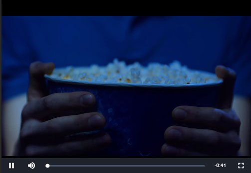
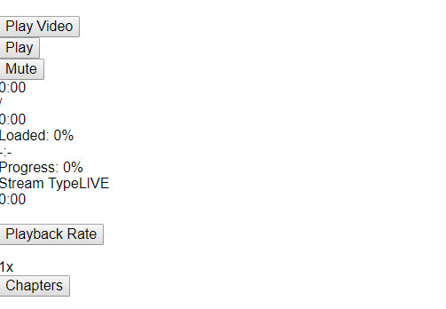
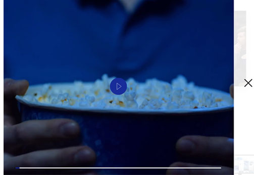

# Video.js

[Video.js](https://github.com/videojs/video.js) - это библиотека с открытым исходным кодом, предназначенная для
создания видео плеера.

Сама по себе библиотека очень проста. Дополнительная функциональность поставляется в плагинах(плейлисты, аналитика,
реклама, и расширенные форматы видео - `HLS` или `DASH`).

## Установка

### NPM

```bash
npm install --save-dev video.js
```

### CDN

```html
<script src="http://vjs.zencdn.net/6.7.1/video.js"></script>
```

```html
<link href="http://vjs.zencdn.net/6.7.1/video-js.css" rel="stylesheet">
```

## Инициализация

На странице должен присутствовать тег:

```html
<video class="video-js"></video>
```

Передаем строку содержащую `id` элемента:

```js
let video = videojs('id');
```

Или `DOM` элемент

```js
let video = videojs(document.querySelector('.video-js'));
```

## Опции

Опции передаются вторым параметром:

```js
let video = videojs('my-video', {
    autoplay: false,
});
```

**Основные опции:**

* `autoplay: boolean` - автоматическое воспроизведение;
* `controls: boolean` - отображать ли интерфейс плеера;
* `loop: boolean` - зацикливание воспроизведения видео;
* `muted: boolean` - приглушение звука;
* `poster: string` - ссылка на превью видео;
* `width: string|number` - ширина видео;
* `height: string|number` - высота видео;

**Дополнительные опции:**

* `fluid: boolean` - подгонять ли видео под размер контейнера;
* `aspectRatio: string` - соотношение сторон видео (16:9, 4:3);

## Методы

* `src(string|array)` - позволяет задать источник видео;

   ```js
   video.src('/path/to/video.mp4');
   
   video.src([
       {
           type: 'video/mp4',
           src: '/path/to/video.mp4',
       },
       {
           type: 'video/webm',
           src: '/path/to/video.webm',
       },
       {
           type: 'video/ogg',
           src: '/path/to/video.ogg',
       },
   ]);
   ```

* `poster(string)` - позволяет задать превью видео;

* `play()` - воспроизводит видео;

* `pause()` - ставит видео на паузу;

* `paused()` - возвращает `true`, если видео стоит на паузе, иначе `false`;

* `dispose()` - полностью удаляет плеер (вызывает событие `dispose`, удаляет все обработчики событий, удаляет `DOM` элементы);

* `volume(number)` - задает горомкость звука (число от `0` до `1`); если вызвать без параметра - возвращает текущее значение;

* `muted(bolean)` - возвращае `true`, если звук выключен, иначе `false`; если передано `true` - выключает звук.

* `requestFullscreen()` - вход в полноэкранный режим;

* `exitFullscreen()` - выход из полноэкранного режима;

* `isFullscreen()` - возвращает `true` если видео находится в полноэкранном режиме, иначе `false`;

* `currentTime(number)` - возвращает текущее место воспроизведения (в секундах); если передать число - устанавливает текущее место;

* `duration()` - возвращает длину видео;

* `remainingTime()` - возвращает оставшееся время;

**Пример:**

```js
let video = videojs('video', {
    controls: true,
    autoplay: false,
    loop: false,
    poster: '/video/cover.jpg',
});

video.src({
    src: '/video/video.mp4',
    withCredentials: true,
});

video.on('ready', () => {
    // ...
});

```

## События

События те же, что у нативного элемента `video`.
Полный список [тут](https://developer.mozilla.org/ru/docs/Web/Guide/Events/Media_events).

**Пример:**

```js
video.on('dispose', () => {
    // ...
});

video.on('play', () => {
    // ...
});

video.on('ended', () => {
    // ...
});
```

## Стриминг (HLS)

Для стриминга `video.js` использует плагин [videojs-contrib-hls](https://github.com/videojs/videojs-contrib-hls).

Как подготовить видео - описано [тут](20_hls.md)

### Установка

```bash
npm install --save videojs-contrib-hls
```

### Инициализация

```js
let video = videojs('my-video', {
    html5: {
        hls: {
            withCredentials: true,
        }
    }
});

video.src({
    src: 'video-name.m3u8',
    type: 'application/x-mpegURL',
    withCredentials: true,
});
```

## Стилизация

По умолчанию используется стандартный скин.

```html
<link href="http://vjs.zencdn.net/6.7.1/video-js.css" rel="stylesheet">
```

**Стандартный скин:**



**Отображение без стилей:**



Для кастомной стилизаци, нужно использовать свои стили.

**Пример своей стилизации:**



- Контейнер

Вписываем контейнер в блок, у которого заданы размеры требуемые
по макету.

```html
<div id="video" class="video-js"></div>
```

```scss
.video-js {
    width: 100%;
    height: 100%;
}
```

- Элемент `<video>`

Подгоняем формат, для предотвращения деформирования видео.

```scss
.vjs-tech {
    width: auto;
    height: 100vh;
    min-width: 100vw;
    object-fit: cover;

    @media (min-aspect-ratio: 1920 / 1080) {
        width: 100vw;
        height: auto;
        min-height: 100vh;
    }
}

```

- Обложка `.vjs-poster`

- Спинер `.vjs-loading-spinner`

- Кнопка воспроизведение\пауза `.vjs-play-control`

- Кнопка вкл\выкл звук `.vjs-mute-control`

- Полоса громкости `.vjs-volume-bar`

- Текущее время видео `.vjs-current-time`

- Длительность видео `.vjs-duration`

- Оставшееся время `.vjs-remaining-time`

- Прогресс бар `.vjs-progress-control`

- Кнопка полноэкранного режима `.vjs-fullscreen-control`

**Пример:**

```scss
.vjs-progress-control {
    display: block;
}

.vjs-progress-holder {
    position: relative;
    height: 4px;
    cursor: pointer;

    &::before {
        content: "";
        position: absolute;
        left: 0;
        width: 100%;
        height: 4px;
        background-color: #fff;
    }
}

.vjs-play-progress {
    position: relative;
    display: block;
    width: 0;
    height: 4px;
    background-color: #000;

    .vjs-control-text {
        display: none;
    }

    .vjs-time-tooltip {
       display: none;
    }
}
```
